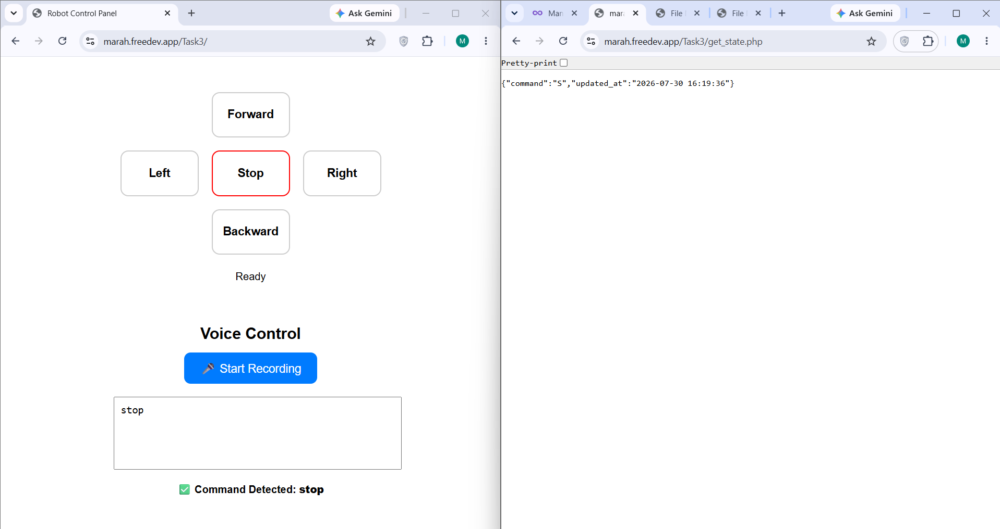
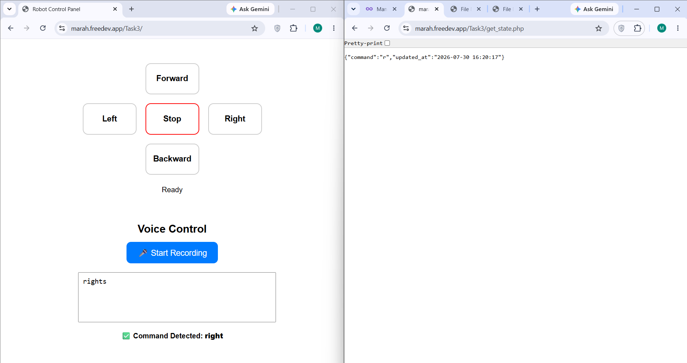

# Robot Control Panel with Voice Commands
A web-based robot control panel that allows users to control a robot using both on-screen buttons and voice commands. The project converts speech to text, recognizes movement commands, updates the robot's command in the database, and stores speech logs for future use.

---

## Features
- Robot movement control using buttons
- Speech-to-Text using Web Speech API
- Automatic command recognition
- Store recognized speech in MySQL database
- Update robot command in real time
- Simple and responsive user interface

---

## Technologies Used
- HTML
- CSS
- JavaScript
- PHP
- MySQL
- Web Speech API

---

## Project Files
| File | Description |
|------|-------------|
| [index.html](index.html) | Main robot control interface |
| [update_command.php](update_command.php) | Updates robot command from button controls |
| [voice_command.php](voice_command.php) | Processes voice commands and stores speech logs |
| [get_state.php](get_state.php) | Retrieves the current robot command |
| [db.php](db.php) | Database connection |
| [setup.sql](setup.sql) | Database tables and initialization |

---

## Output Screenshots

### Screenshot 1
STOP

### Screenshot 2
RIGHT

---

## Live Demo

**Website**

[https://marah.freedev.app/Task3/
](https://marah.freedev.app/Task3/)

## Robot State
https://marah.freedev.app/Task3/get_state.php

---

## How It Works
1. Press one of the movement buttons **or** click **Start Recording**.
2. Speak a command such as:
   - Move forward
   - Turn left
   - Stop
3. The speech is converted into text.
4. The command is recognized.
5. The command is saved in the database.
6. The robot state is updated automatically.

---
